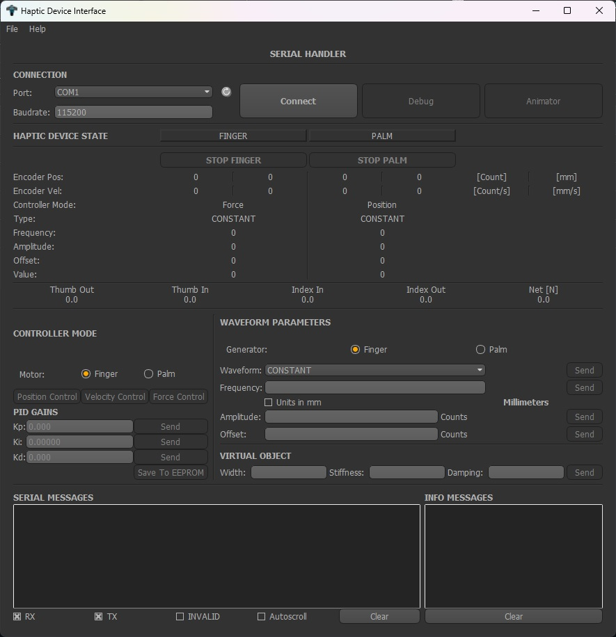

# Desktop App for Controlling the Haptic Device
This is a desktop application for controlling the haptic device. It is written in Python and uses the [PyQt5](https://pypi.org/project/PyQt5/) library for the GUI.
<!-- SS Image -->
