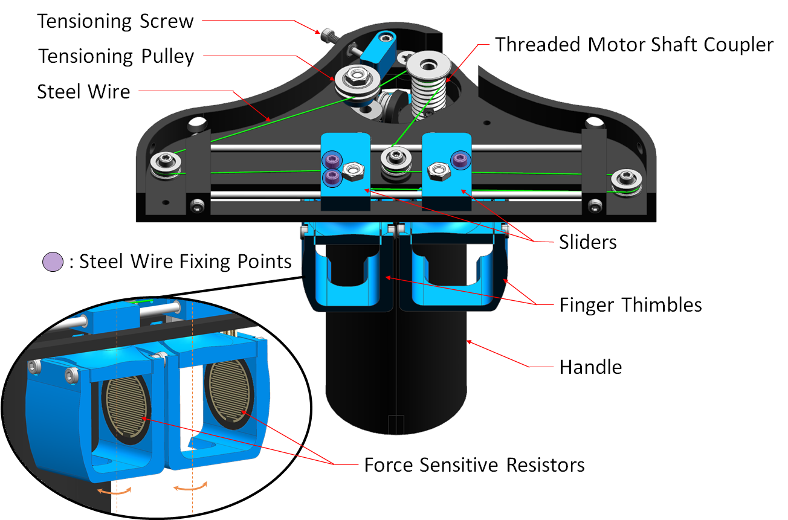
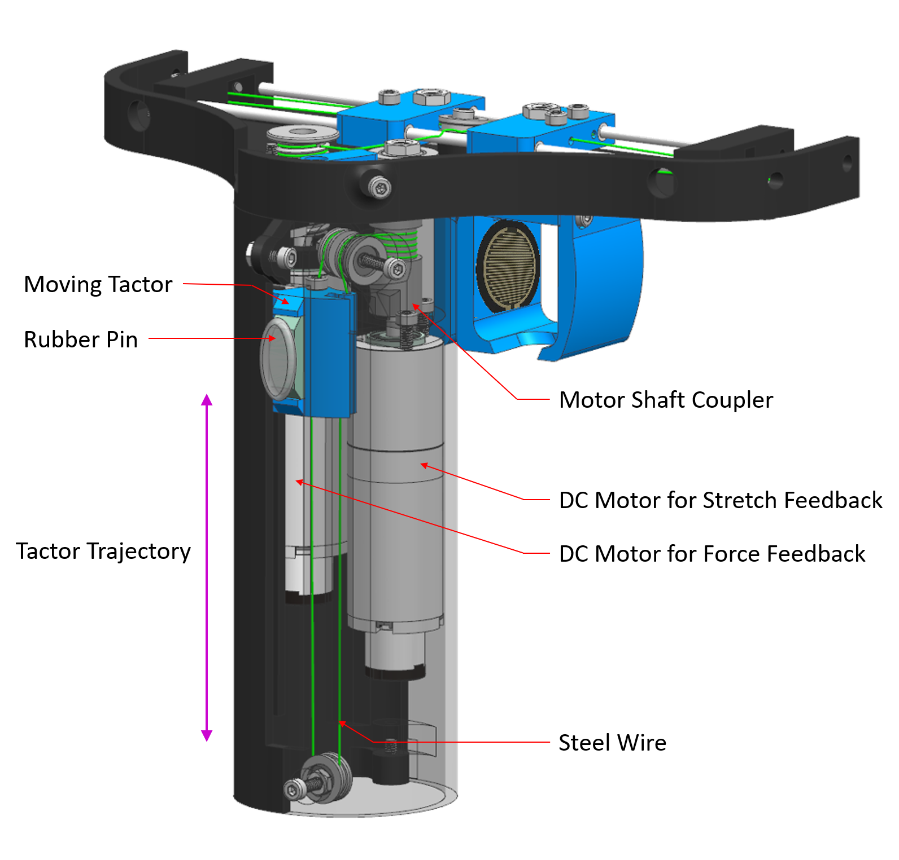

# Haptic Device

During my master's degree, I worked on a developing a haptic device for a virtual reality application. The device was designed to simulate the stiffness and the inertia of virtual objects. 
<table>
  <tr>
    <td></td>
    <td></td>
  </tr>
</table>

<!-- put Theses.pdf link -->
You can find the detailed information in my [thesis](Thesis.pdf).

Paper where we evaluated the stiffness rendering performance of the device through sets of psychophysical experiments is to be published soon.
